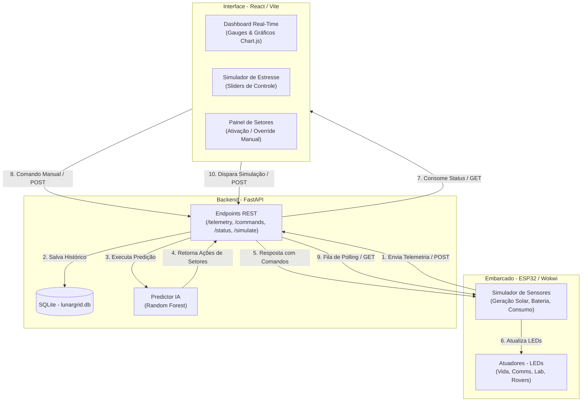

# LunarGrid – Gerenciamento Energético Inteligente para Base Lunar

O **LunarGrid** é um sistema inteligente de gerenciamento e otimização de malha energética projetado para bases operacionais em ambientes extremos, com foco no ciclo lunar. O sistema combina hardware embarcado para coleta e atuação local, inteligência artificial preditiva para antecipação de transições críticas (como a noite lunar de 354 horas terrestres) e uma interface web para monitoramento em tempo real e simulação de estresse.

---

## 🏗️ Arquitetura do Sistema

O sistema é dividido em três camadas independentes e desacopladas, comunicando-se via APIs REST:

1. **Módulo Embarcado (ESP32)**: Coleta e simula a telemetria energética (geração solar, nível da bateria, consumo) e atua nos setores através de pinos GPIO (LEDs).
2. **API Backend (Python/FastAPI)**: Persiste os dados de telemetria em um banco de dados SQLite e executa um modelo de Machine Learning (**RandomForestClassifier**) para predição de risco e tomada de decisão sobre desligamento de setores.
3. **Frontend Dashboard (React)**: Apresenta os dados em tempo real, permite controle manual de override nos setores e simulação de cenários críticos.

### Diagrama de Arquitetura (Fluxo de Dados)



---

## 🚀 Funcionalidades Principais

* **Monitoramento em Tempo Real (RF-008)**: Dashboard com medidores circulares para bateria/geração solar e gráfico temporal histórico.
* **Ciclo Lunar Cíclico (RF-006)**: Relógio lunar animado que rastreia as fases diurnas (presença de sol) e noturnas (sombra completa).
* **Inteligência Artificial Preditiva (RF-007)**: Previsão de risco de colapso de energia em 4 níveis (`baixo`, `médio`, `alto`, `crítico`) com desligamento preventivo e ordenado de setores por prioridade (4 → 3 → 2).
* **Controle de Setores e Override (RF-011)**: Visualização rica do status de cada setor e botão para ligar/desligar manualmente, cancelando temporariamente a IA em emergências.
* **Simulador de Estresse (RF-010)**: Modifique geração, bateria e hora lunar por sliders ou presets ("Noite Total", "Tempestade de Poeira") para testar imediatamente a reação da IA no painel e nos LEDs do ESP32.

---

## 🛠️ Tecnologias Utilizadas

* **Frontend**: React 19, Vite, Chart.js, CSS Vanilla (Design Moderno Dark Theme, Glassmorphism e Micro-Animações).
* **Backend**: Python 3.10+, FastAPI, SQLite, Scikit-Learn (Random Forest), Pandas, NumPy, Joblib, Pydantic.
* **Firmware**: C++ (Arduino Framework para ESP32), ArduinoJson, biblioteca WiFi.

---

## 📦 Como Rodar o Projeto

### 1. API Backend (Python)

1. Navegue até a pasta da API:
   ```bash
   cd api
   ```
2. Crie e ative um ambiente virtual (opcional, mas recomendado):
   ```bash
   python3 -m venv .venv
   source .venv/bin/activate  # No Windows: .venv\Scripts\activate
   ```
3. Instale as dependências:
   ```bash
   pip install -r requirements.txt
   ```
4. Certifique-se de que o modelo preditivo está treinado:
   ```bash
   python models/train.py
   ```
5. Inicie o servidor FastAPI:
   ```bash
   uvicorn main:app --reload --host 0.0.0.0 --port 8000
   ```
   > A documentação Swagger interativa estará disponível em [http://localhost:8000/docs](http://localhost:8000/docs).

### 2. Frontend React

1. Abra um novo terminal e navegue até a pasta `front`:
   ```bash
   cd front
   ```
2. Instale os pacotes npm:
   ```bash
   npm install
   ```
3. Execute em modo de desenvolvimento:
   ```bash
   npm run dev
   ```
   > Acesse o painel pelo navegador em [http://localhost:5173](http://localhost:5173).

### 3. Firmware ESP32 (Wokwi)

O firmware está configurado para rodar no simulador online Wokwi ou em placa física utilizando o VS Code com a extensão PlatformIO.

1. Abra o site [wokwi.com](https://wokwi.com) e crie um projeto novo para **ESP32**.
2. Copie o conteúdo de `esp32/src/main.cpp` e cole no arquivo principal (`sketch.ino` no editor do Wokwi).
3. Substitua o conteúdo do arquivo `diagram.json` do simulador pelo arquivo `esp32/diagram.json` do projeto.
4. Adicione a biblioteca **ArduinoJson** no gerenciador de bibliotecas (Library Manager) do Wokwi.
5. No código (`main.cpp` ou `sketch.ino`), mude o `API_HOST` para o endereço IP local do seu computador rodando o backend (ex: `192.168.1.15`).
6. Execute a simulação. Os LEDs acenderão de acordo com o status atualizado do backend.
