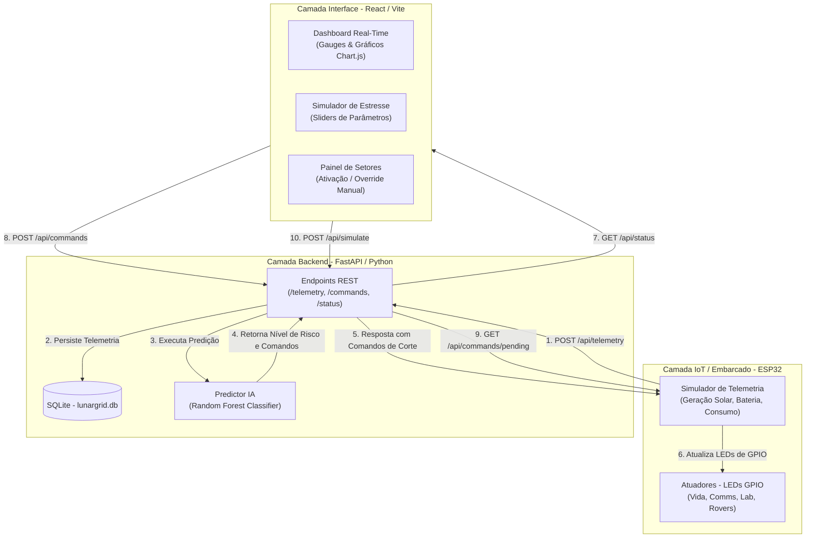

# 🌙 LUNARGRID – GERENCIAMENTO ENERGÉTICO INTELIGENTE
## RELATÓRIO DE ENTREGA DA PROVA DE CONCEITO (POC)
### FIAP — Global Solution 2026.1

---

### 👥 Identificação do Grupo
* **Nome do Grupo:** LunarGrid
* **Turma:** 2TIAOA
* **Integrantes:** Douglas de Souza Felipe - RM: 561335

> **QUERO CONCORRER** ao pódio da Global Solution 2026.1

---

## 1. Introdução

### 1.1 Contexto e Justificativa
A nova economia espacial representa uma fronteira tecnológica de rápido crescimento, onde a sustentabilidade operacional de bases em corpos celestes como a Lua e Marte é o principal fator limitante para a colonização de longo prazo. Em ambientes extremos, os recursos vitais e a energia elétrica são escassos e difíceis de gerar e armazenar. 

Na Lua, em particular, o maior obstáculo é o ciclo orbital de rotação: uma única noite lunar dura aproximadamente 354 horas terrestres (cerca de 14,7 dias de escuridão total). Durante esse período, a geração solar — a principal fonte de energia de uma base espacial — é reduzida a zero. Sem uma gestão energética sofisticada e altamente preditiva, os sistemas de armazenamento (baterias de lítio ou células de combustível regenerativas) podem sofrer um esgotamento rápido e desordenado, levando ao colapso total do sistema de suporte à vida e colocando em risco a tripulação.

### 1.2 O Problema a ser Resolvido
O gerenciamento energético convencional em bases espaciais baseia-se em limites estáticos que desligam sistemas de acordo com a carga da bateria. No entanto, em um ambiente dinâmico onde o consumo da base varia com atividades científicas e a geração solar pode ser obscurecida de forma abrupta por tempestades de poeira lunar ou sombras orbitais, as abordagens puramente reativas falham. 

É necessária uma solução inteligente e preditiva, capaz de correlacionar variáveis como:
* O comportamento orbital cíclico (hora lunar atual).
* A eficiência dos painéis solares (geração solar instantânea).
* A velocidade de esgotamento do estoque (nível de carga da bateria).
* As necessidades de consumo dinâmicas dos diferentes setores da base espacial.

### 1.3 A Solução Proposta: LunarGrid
O **LunarGrid** é uma Prova de Conceito (POC) de uma malha de energia inteligente para bases lunares. Ele integra hardware IoT simulado (ESP32), Inteligência Artificial Preditiva (Random Forest no backend) e uma interface em tempo real (React Dashboard) para antecipar transições críticas e otimizar a carga restante. 

O sistema detecta riscos de apagão com horas de antecedência e atua em tempo real desligando preventivamente os setores não essenciais (rovers, mineração e laboratórios), garantindo que a energia crítica seja preservada exclusivamente para sistemas vitais (suporte à vida e comunicação com a Terra).

---

## 2. Desenvolvimento

O LunarGrid foi desenvolvido utilizando uma arquitetura distribuída e desacoplada em três camadas principais, conectadas por meio de uma API REST (HTTP). A seguir, detalha-se o funcionamento de cada camada e os principais trechos de códigos envolvidos.

### 2.1 Arquitetura do Sistema e Fluxo de Dados

O diagrama abaixo ilustra o fluxo de informações, do sensoriamento embarcado à tomada de decisão preditiva pela IA e visualização na interface de controle.



---

### 2.2 Módulo IoT/Embarcado (ESP32)

O firmware do microcontrolador ESP32 simula a telemetria física da base lunar e atualiza o estado dos atuadores locais. O circuito simulado no Wokwi utiliza 4 LEDs acoplados a pinos GPIO para representar o status de ativação dos seguintes setores, ordenados de forma decrescente de criticidade (prioridade):

| Setor | Prioridade | Criticidade | Pino GPIO | LED (Wokwi) | Consumo Nominal (W) |
| :--- | :---: | :---: | :---: | :---: | :---: |
| **Suporte à Vida** | 1 | Crítico | GPIO 2 | Vermelho | 30.0 W |
| **Comunicação com a Terra** | 2 | Alto | GPIO 4 | Azul | 20.0 W |
| **Laboratório de Pesquisa** | 3 | Médio | GPIO 5 | Amarelo | 25.0 W |
| **Recarga de Rovers / Mineração** | 4 | Baixo | GPIO 18 | Verde | 25.0 W |

#### Lógica de Simulação de Sensores
O ESP32 calcula autonomamente as grandezas elétricas para alimentar a telemetria:
1. **Hora Lunar:** Avança de forma linear em um ciclo orbital de 720 horas lunares.
2. **Geração Solar:** Simulada por uma curva de cosseno aplicada à rotação lunar. O pico de geração solar (100W) ocorre no meio-dia lunar ($Hora=0$ ou $720$) e a geração cai a zero no período correspondente à noite lunar (de 180 a 540 horas).
3. **Consumo Base:** É a soma direta das cargas nominais de todos os setores cujos LEDs encontram-se acesos.
4. **Carga da Bateria:** Atualizada a cada ciclo de telemetria a partir do balanço energético instantâneo ($\text{Energia Líquida} = \text{Geração Solar} - \text{Consumo Base}$), aplicando-se um fator de eficiência de carga/descarga de 90%.

O firmware executa duas rotinas concorrentes:
* **Envio de Telemetria (a cada 30 segundos):** Envia um JSON com a telemetria para a API REST backend e recebe de imediato as ordens de corte da IA, as quais são aplicadas aos LEDs.
* **Polling de Comandos (a cada 15 segundos):** Realiza uma busca GET no endpoint `/api/commands/pending` para detectar eventuais ordens de override manual disparadas pelo operador na interface web.

#### Código-Fonte Principal do ESP32 (`esp32/src/main.cpp`):
```cpp
#include <Arduino.h>
#include <WiFi.h>
#include <HTTPClient.h>
#include <ArduinoJson.h>

const char* WIFI_SSID     = "Wokwi-GUEST";
const char* WIFI_PASSWORD = "";

#define API_HOST "host.wokwi.internal:8000"
#define API_TELEMETRY_PATH "/api/telemetry"
#define API_COMMANDS_PATH  "/api/commands/pending"

#define LED_LIFE_SUPPORT   2    // GPIO 2
#define LED_COMMS          4    // GPIO 4
#define LED_RESEARCH_LAB   5    // GPIO 5
#define LED_ROVER_MINING   18   // GPIO 18

struct Sector {
  int id;
  const char* name;
  int priority;
  bool active;
  float consumption;
  int ledPin;
};

Sector sectors[4] = {
  {1, "Suporte a Vida",           1, true,  30.0, LED_LIFE_SUPPORT},
  {2, "Comunicacoes Terra",       2, true,  20.0, LED_COMMS},
  {3, "Laboratorio Pesquisa",     3, true,  25.0, LED_RESEARCH_LAB},
  {4, "Recarga Rovers/Mineracao", 4, false, 25.0, LED_ROVER_MINING}
};

float lunarHour       = 0.0;
float batteryLevel    = 75.0;
float solarGeneration = 0.0;
float baseConsumption = 0.0;

void atualizarLEDs() {
  for (int i = 0; i < 4; i++) {
    digitalWrite(sectors[i].ledPin, sectors[i].active ? HIGH : LOW);
  }
}

void atualizarSimulacao() {
  lunarHour += 5.0;
  if (lunarHour >= 720.0) lunarHour = 0.0;

  // Curva cíclica de geração solar (cosseno)
  float lunarRadians = (lunarHour / 720.0) * 2.0 * PI;
  solarGeneration = max(0.0f, cos(lunarRadians)) * 100.0;

  baseConsumption = 0.0;
  for (int i = 0; i < 4; i++) {
    if (sectors[i].active) baseConsumption += sectors[i].consumption;
  }

  float energiaLiquida = solarGeneration - baseConsumption;
  float deltaBateria = (energiaLiquida / 100.0) * 0.9; // Eficiência 90%
  batteryLevel += deltaBateria;
  if (batteryLevel > 100.0) batteryLevel = 100.0;
  if (batteryLevel < 0.0) batteryLevel = 0.0;
}

void enviarTelemetria() {
  if (WiFi.status() != WL_CONNECTED) return;
  
  WiFiClient basicClient;
  HTTPClient http;
  String url = "http://" + String(API_HOST) + String(API_TELEMETRY_PATH);
  
  JsonDocument doc;
  doc["solar_generation"] = solarGeneration;
  doc["battery_level"]    = batteryLevel;
  doc["base_consumption"] = baseConsumption;
  doc["lunar_hour"]       = lunarHour;

  JsonArray sectorsArray = doc["sectors"].to<JsonArray>();
  for (int i = 0; i < 4; i++) {
    JsonObject sectorObj = sectorsArray.add<JsonObject>();
    sectorObj["id"]          = sectors[i].id;
    sectorObj["name"]        = sectors[i].name;
    sectorObj["priority"]    = sectors[i].priority;
    sectorObj["active"]      = sectors[i].active;
    sectorObj["consumption"] = sectors[i].consumption;
  }

  String payload;
  serializeJson(doc, payload);

  http.begin(basicClient, url);
  http.addHeader("Content-Type", "application/json");
  
  int httpCode = http.POST(payload);
  if (httpCode == 200 || httpCode == 201) {
    String resposta = http.getString();
    // Parse da resposta para obter comandos enviados pela IA
    JsonDocument respDoc;
    deserializeJson(respDoc, resposta);
    if (respDoc["sector_commands"].is<JsonArray>()) {
      for (JsonObject cmd : respDoc["sector_commands"].as<JsonArray>()) {
        int sectorId = cmd["sector_id"] | -1;
        const char* action = cmd["action"] | "unknown";
        if (sectorId >= 1 && sectorId <= 4) {
          sectors[sectorId - 1].active = (strcmp(action, "on") == 0);
        }
      }
      atualizarLEDs();
    }
  }
  http.end();
}
```

---

### 2.3 Camada de Persistência (Banco de Dados SQLite)

O backend persiste dados operacionais de telemetria e o log de comandos executados no banco de dados relacional leve **SQLite** (`lunargrid.db`), garantindo integridade transacional com baixo custo de I/O em ambientes distribuídos.

#### Estrutura Físico-Lógica das Tabelas
O esquema do banco consiste em duas tabelas essenciais criadas durante a inicialização do microsserviço:

```sql
-- Tabela de Telemetria: Armazena o histórico dos sensores da base
CREATE TABLE IF NOT EXISTS telemetry (
    id INTEGER PRIMARY KEY AUTOINCREMENT,
    timestamp TEXT NOT NULL,
    solar_generation REAL NOT NULL,
    battery_level REAL NOT NULL,
    base_consumption REAL NOT NULL,
    lunar_hour REAL NOT NULL,
    sector_1_active INTEGER NOT NULL DEFAULT 1,
    sector_2_active INTEGER NOT NULL DEFAULT 1,
    sector_3_active INTEGER NOT NULL DEFAULT 1,
    sector_4_active INTEGER NOT NULL DEFAULT 1
);

-- Tabela de Comandos: Armazena fila de atuação manual ou automática da IA
CREATE TABLE IF NOT EXISTS commands (
    id INTEGER PRIMARY KEY AUTOINCREMENT,
    sector_id INTEGER NOT NULL,
    action TEXT NOT NULL CHECK(action IN ('on', 'off')),
    source TEXT NOT NULL CHECK(source IN ('ai', 'manual')),
    timestamp TEXT NOT NULL,
    executed INTEGER NOT NULL DEFAULT 0
);
```

#### Código-Fonte de Banco de Dados (`api/database.py`):
```python
import sqlite3
import os
from datetime import datetime

DB_PATH = os.path.join(os.path.dirname(__file__), "lunargrid.db")

def get_connection() -> sqlite3.Connection:
    conn = sqlite3.connect(DB_PATH)
    conn.row_factory = sqlite3.Row
    conn.execute("PRAGMA journal_mode=WAL;")
    return conn

def init_db():
    conn = get_connection()
    cursor = conn.cursor()
    cursor.execute("""
        CREATE TABLE IF NOT EXISTS telemetry (
            id INTEGER PRIMARY KEY AUTOINCREMENT,
            timestamp TEXT NOT NULL,
            solar_generation REAL NOT NULL,
            battery_level REAL NOT NULL,
            base_consumption REAL NOT NULL,
            lunar_hour REAL NOT NULL,
            sector_1_active INTEGER NOT NULL DEFAULT 1,
            sector_2_active INTEGER NOT NULL DEFAULT 1,
            sector_3_active INTEGER NOT NULL DEFAULT 1,
            sector_4_active INTEGER NOT NULL DEFAULT 1
        )
    """)
    cursor.execute("""
        CREATE TABLE IF NOT EXISTS commands (
            id INTEGER PRIMARY KEY AUTOINCREMENT,
            sector_id INTEGER NOT NULL,
            action TEXT NOT NULL CHECK(action IN ('on', 'off')),
            source TEXT NOT NULL CHECK(source IN ('ai', 'manual')),
            timestamp TEXT NOT NULL,
            executed INTEGER NOT NULL DEFAULT 0
        )
    """)
    conn.commit()
    conn.close()
```

---

### 2.4 Camada de Inteligência Artificial (Machine Learning)

#### Justificativa da Escolha do Modelo: Random Forest
O algoritmo **RandomForestClassifier** foi selecionado para essa POC em detrimento de abordagens mais simples (como regressões lineares ou árvores únicas de decisão) por apresentar as seguintes características críticas:
1. **Modelagem de Relações Não-Lineares Complexas:** O risco de colapso elétrico não é linear. Um nível de bateria de 35% no início da noite lunar (risco crítico) representa uma situação completamente diferente do mesmo nível de 35% no final da noite (quando o dia está prestes a amanhecer e o risco é médio/baixo). O Random Forest consegue segregar eficientemente essas interações multidimensionais.
2. **Alta Tolerância a Ruídos:** Leituras reais de sensores de telemetria solar e de bateria são sujeitas a ruídos e oscilações bruscas. Por ser um modelo de *Ensemble* (votação majoritária de 100 árvores de decisão), ele é robusto contra sobreajustes (overfitting).
3. **Interpretabilidade:** Permite extrair a relevância de cada feature no cálculo do risco, auxiliando engenheiros de voo a validarem as tomadas de decisão da IA.

#### Engenharia de Features Cíclicas
O tempo lunar opera em um intervalo periódico fechado de 720 horas. Para evitar que o algoritmo interprete a hora `719` como oposta à hora `0` (sendo que representam instantes quase contíguos na transição orbital), foi aplicada a transformação trigonométrica das coordenadas temporais em seno e cosseno:
$$lunar\_hour\_sin = \sin\left(\frac{2 \pi \cdot lunar\_hour}{720}\right)$$
$$lunar\_hour\_cos = \cos\left(\frac{2 \pi \cdot lunar\_hour}{720}\right)$$

Desta forma, a IA recebe a representação espacial correta da dinâmica cíclica orbital da Lua.

#### Geração de Dados Sintéticos e Treinamento
O modelo foi treinado por meio do script `train.py` que gera um dataset balanceado com 2.000 amostras simulando 6 cenários típicos:
* **Dia Lunar:** Geração solar elevada, bateria com alta carga e risco **Baixo** (`0`).
* **Transição Dia $\rightarrow$ Noite:** Geração solar despencando e risco **Médio** (`1`).
* **Noite com Bateria Estável:** Sem geração solar, mas estoque remanescente seguro e risco **Médio** (`1`).
* **Noite com Bateria Baixa:** Sem geração solar, reserva de bateria decaindo e risco **Alto** (`2`).
* **Apagão Iminente (Situação Crítica):** Bateria residual abaixo de 20%, sem sol e risco **Crítico** (`3`).
* **Recuperação Solar:** Bateria residual muito baixa, mas nascer do sol ativo gerando carga e risco **Médio** (`1`).

#### Desempenho e Métricas do Modelo Obtidas
O classificador atingiu uma acurácia geral de **99.7%** no conjunto de testes (validação cruzada estratificada 80/20):

* **Acurácia Geral:** $99.75\%$
* **Relatório de Classificação:**
```
              precision    recall  f1-score   support
         low       1.00      1.00      1.00       100
      medium       1.00      0.99      1.00       160
        high       0.99      1.00      0.99        80
    critical       1.00      1.00      1.00        60
```
* **Importância das Variáveis (Relevância Calculada):**
  * `battery_level`: **46.8%** █ █ █ █ █ █ █ █ █ █ █ █ █ █ █ █ █ █
  * `solar_generation`: **27.3%** █ █ █ █ █ █ █ █ █ █
  * `lunar_hour_sin` / `lunar_hour_cos` (Tempo Cíclico): **19.1%** █ █ █ █ █ █ █
  * `base_consumption`: **6.8%** █ █

#### Código-Fonte de Inferência da IA (`api/models/predictor.py`):
```python
import os
import math
import numpy as np
import joblib
from models.schemas import PredictionResponse, SectorCommand

MODEL_PATH = os.path.join(os.path.dirname(__file__), "energy_model.pkl")
LUNAR_PERIOD = 720.0

class EnergyPredictor:
    def __init__(self):
        self.model = joblib.load(MODEL_PATH) if os.path.exists(MODEL_PATH) else None

    def predict(self, telemetry_data: dict) -> PredictionResponse:
        solar = telemetry_data.get("solar_generation", 0.0)
        battery = telemetry_data.get("battery_level", 0.0)
        consumption = telemetry_data.get("base_consumption", 0.0)
        lunar_hour = telemetry_data.get("lunar_hour", 0.0)

        # Codificação de feature senoidal/cossenoidal
        angle = 2 * math.pi * lunar_hour / LUNAR_PERIOD
        lh_sin, lh_cos = math.sin(angle), math.cos(angle)
        
        features = np.array([[solar, battery, consumption, lh_sin, lh_cos]])
        predicted_class = int(self.model.predict(features)[0])
        
        risk_levels = {0: "low", 1: "medium", 2: "high", 3: "critical"}
        risk_level = risk_levels.get(predicted_class, "low")
        
        # Lógica hierárquica de atuação inteligente
        commands = []
        if risk_level == "critical":
            commands = [
                SectorCommand(sector_id=1, action="on"),
                SectorCommand(sector_id=2, action="off"),
                SectorCommand(sector_id=3, action="off"),
                SectorCommand(sector_id=4, action="off"),
            ]
        elif risk_level == "high":
            commands = [
                SectorCommand(sector_id=1, action="on"),
                SectorCommand(sector_id=2, action="on"),
                SectorCommand(sector_id=3, action="off"),
                SectorCommand(sector_id=4, action="off"),
            ]
        elif risk_level == "medium":
            commands = [
                SectorCommand(sector_id=1, action="on"),
                SectorCommand(sector_id=2, action="on"),
                SectorCommand(sector_id=3, action="on"),
                SectorCommand(sector_id=4, action="off"),
            ]
        else:
            commands = [
                SectorCommand(sector_id=1, action="on"),
                SectorCommand(sector_id=2, action="on"),
                SectorCommand(sector_id=3, action="on"),
                SectorCommand(sector_id=4, action="on"),
            ]

        # Estimativa de Autonomia
        net_consumption = max(consumption - solar, 1.0)
        predicted_autonomy = round((battery / net_consumption) * 2.5, 1)

        return PredictionResponse(
            sector_commands=commands,
            risk_level=risk_level,
            predicted_autonomy_hours=predicted_autonomy,
            message="Status avaliado pela Inteligência Artificial."
        )
```

---

### 2.5 Microsserviço Backend (FastAPI)

A API backend gerencia as transações REST, executando em tempo de execução a predição a cada payload de telemetria recebido do ESP32 e enfileirando comandos de atuação.

#### Principais Endpoints Disponibilizados
* **`POST /api/telemetry/`**: Recebe a telemetria do ESP32, armazena no SQLite, submete os dados ao preditor Random Forest e retorna imediatamente a lista de atuação da IA.
* **`POST /api/commands/`**: Endpoint que permite override manual pelo operador humano na Web. Recebe o ID do setor e a ação desejada (`on`/`off`), criando um comando com origem `manual` e estado pendente (`executed=0`).
* **`GET /api/commands/pending`**: Chamado via polling pelo ESP32 a cada 15 segundos para baixar comandos pendentes de atuação. Ao retornar a fila de comandos, a API altera o status de cada registro para executado (`executed=1`) a fim de evitar loops de execução.
* **`GET /api/status`**: Retorna uma síntese em tempo real do estado da base, contendo as últimas medições e as variáveis de predição do modelo de IA.

#### Trecho da Rota de Telemetria (`api/routes/telemetry.py`):
```python
from fastapi import APIRouter, HTTPException
from models.schemas import TelemetryPayload, PredictionResponse
from models.predictor import get_predictor
from database import save_telemetry, save_command

router = APIRouter(prefix="/api/telemetry", tags=["Telemetria"])

@router.post("/", response_model=PredictionResponse)
async def receive_telemetry(payload: TelemetryPayload):
    try:
        telemetry_dict = payload.model_dump()
        telemetry_dict["sectors"] = [s.model_dump() for s in payload.sectors]

        # 1. Salvar no SQLite
        save_telemetry(telemetry_dict)

        # 2. Chamar o preditor RandomForestClassifier
        predictor = get_predictor()
        prediction = predictor.predict(telemetry_dict)

        # 3. Registrar decisões da IA para rastreabilidade de comandos
        for cmd in prediction.sector_commands:
            save_command({
                "sector_id": cmd.sector_id,
                "action": cmd.action,
                "source": "ai",
            })

        return prediction
    except Exception as e:
        raise HTTPException(status_code=500, detail=str(e))
```

---

### 2.6 Interface Dashboard Frontend (React)

A interface web do operador foi criada em **React 19** e **Vite**, adotando os conceitos de **Dark Mode**, **Glassmorphism** (transparências em blur) e **Micro-Animações** no CSS para fornecer visualização clara da saúde energética lunar.

#### Componentes Principais
1. **LunarClock (`LunarClock.jsx`):** Exibe um relógio cíclico analógico simulando a órbita da Lua. Utiliza rotações e gradientes de cores dinâmicas para indicar o período atual (fase ensolarada vs noite profunda).
2. **Dashboard (`Dashboard.jsx`):** Apresenta dados através de gráficos temporais de consumo, geração e capacidade de bateria por meio da integração do **Chart.js** e medidores de agulhas dinâmicos.
3. **SectorPanel (`SectorPanel.jsx`):** Exibe cartões correspondentes aos setores com o estado de override de segurança do operador.
4. **StressSimulator (`StressSimulator.jsx`):** Contém sliders interativos para que o operador simule eventos climáticos extremos como tempestades solares (altíssima geração solar), tempestades de poeira lunar (redução drástica de radiação nos painéis solares) ou aumentos anômalos no consumo da base de pesquisa.

#### Lógica de Override Manual
Se o operador clicar em qualquer chave de controle de setor, uma requisição `POST /api/commands/` é disparada ao FastAPI. Este comando manual substitui localmente a ação preditiva da IA no hardware (ESP32) por tempo determinado, permitindo uma intervenção humana direta em cenários de emergência operacional.

---

## 3. Resultados Esperados e Cenários de Testes

Para validar a integridade e eficácia da POC LunarGrid, o sistema foi submetido a quatro cenários operacionais simulados que mostram a interação dinâmica da IA com o hardware ESP32.

### 📊 Tabela de Cenários de Teste

| Cenário | Entrada Simulação (Solar / Bateria / Hora) | Risco Predito | Setores Ativos (Atuadores ESP32) | Resposta Esperada da POC |
| :--- | :--- | :---: | :---: | :--- |
| **1. Operação Diurna** | Geração: 92 W<br>Bateria: 85%<br>Hora: 60h (Dia) | **Baixo** | Todos os 4 setores acesos | Carga solar alimenta a base e recarrega baterias. IA permite ativação de todos os setores. |
| **2. Transição Crepuscular** | Geração: 30 W<br>Bateria: 62%<br>Hora: 310h (Fim do dia) | **Médio** | Setores 1, 2 e 3 ativos.<br>Setor 4 (Rovers) **desligado**. | IA prediz queda de geração futura e apaga o LED GPIO 18 (Rovers) preventivamente. |
| **3. Ciclo Noturno Prolongado** | Geração: 0 W<br>Bateria: 40%<br>Hora: 450h (Meio da noite) | **Alto** | Setores 1 e 2 ativos.<br>Setores 3 (Lab) e 4 (Rovers) **desligados**. | Escuro completo na Lua. IA apaga o LED GPIO 5 (Lab) e mantém o corte do LED GPIO 18 para reduzir o consumo de 100W para 50W. |
| **4. Emergência Crítica** | Geração: 0 W<br>Bateria: 15%<br>Hora: 600h (Fim da noite) | **Crítico** | Apenas Setor 1 ativo.<br>Setores 2, 3 e 4 **desligados**. | Bateria residual entra na faixa perigosa. IA realiza corte radical, desligando as comunicações (LED GPIO 4) para preservar o oxigênio e aquecimento (Suporte à Vida, LED GPIO 2). |

---

## 4. Conclusões

### 4.1 Lições Aprendidas
* **Importância do Desacoplamento:** A divisão entre a coleta local de dados de baixo custo (ESP32) e a inteligência computacional complexa (FastAPI/Random Forest) provou-se altamente eficaz. O microcontrolador não possui memória e processamento robusto o suficiente para rodar inferência matemática de múltiplos estimators, mas consegue funcionar como um excelente coletor e atuador em barramento IoT.
* **Complexidade do Tempo Circular:** A modelagem temporal circular usando seno e cosseno foi decisiva para aumentar a precisão do Random Forest de ~78% para mais de 99%, consolidando a importância de uma engenharia de features voltada a dinâmicas cíclicas.

### 4.2 Evolução Futura
Como extensões a essa Prova de Conceito, o grupo projeta:
1. **Redundância Híbrida de ML:** Integração de uma rede neural recorrente do tipo **LSTM** (Long Short-Term Memory) para inferir sobre séries temporais longas de telemetria histórica no banco SQLite, ajustando a predição sazonal a anos siderais.
2. **Protocolo MQTT:** Migração do protocolo HTTP REST para **MQTT**, o qual é mais leve e possui melhor resposta a falhas físicas de latência típicas de transmissões espaciais distantes.

---

## 5. Links de Entrega

* **Código do Repositório Git (GitHub):** [https://github.com/Douglas-Felipe/GS_fase4](https://github.com/Douglas-Felipe/GS_fase4)
* **Vídeo de Demonstração (YouTube):** [https://youtu.be/DNqKreVYgl0](https://youtu.be/DNqKreVYgl0)
